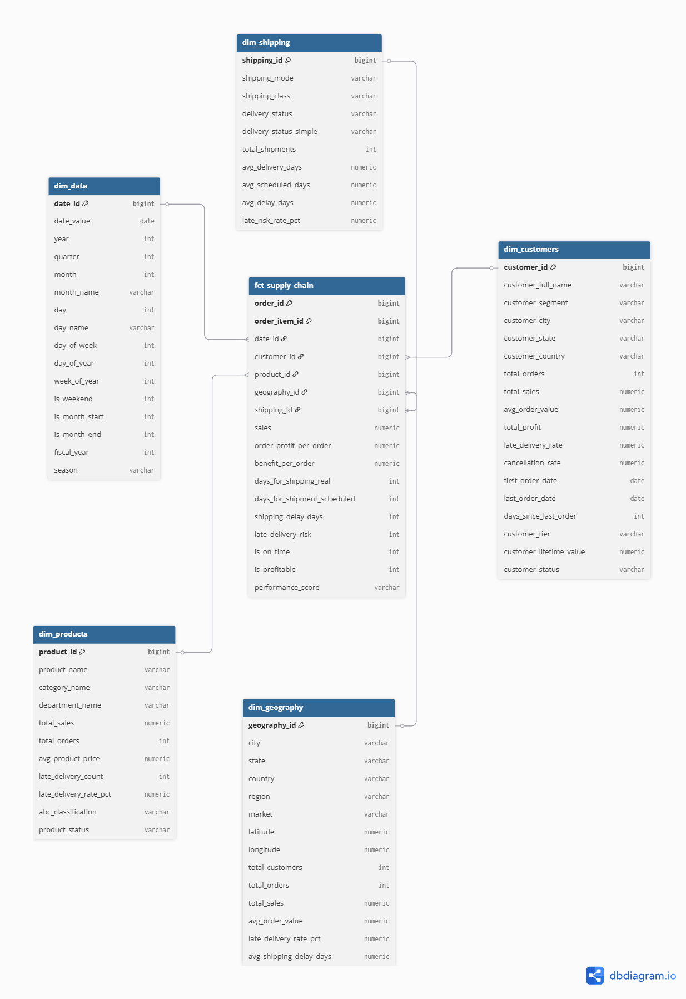

# Supply Chain Analytics : Prédiction de Demande et Optimisation d'Inventaire

## Description du Projet

Architecture complète de Business Intelligence pour l'analyse et l'optimisation de la chaîne logistique. Combine l'ETL, la transformation de données et le Machine Learning pour fournir des insights actionnables sur les performances logistiques avec prédictions de demande et détection des risques de retard.

**Technologies utilisées:**
- Apache Airflow - Orchestration du pipeline ETL
- dbt - Transformation et modélisation SQL
- PostgreSQL - Data Warehouse
- Python + XGBoost - Machine Learning
- Power BI - Dashboards interactifs

## Pipeline Airflow

*Pipeline ETL orchestré avec succès : extraction, transformation, tests qualité, feature engineering et prédictions ML.*

### Phases du Pipeline

1. **Extraction**: Chargement du CSV Kaggle (~180k lignes) vers PostgreSQL schéma `raw_data`
2. **Transformation dbt**: Staging (nettoyage), intermediate (agrégations), marts (schéma en étoile)
3. **Tests Qualité**: Validation des données (not_null, unique) et tests métier (pas de dates futures, cohérence délais)
4. **Feature Engineering**: Création de 25+ features temporelles, géographiques et catégorielles depuis les marts
5. **ML Modeling**: Entraînement XGBoost (demande: régression; retard: classification) avec sauvegarde modèles
6. **Export**: Prédictions sauvegardées dans `analytics.ml_predictions` et `analytics.ml_model_metrics`

## Architecture du Système et Schéma en Étoile

*Architecture en étoile : table de faits centrale connectée aux dimensions (clients, produits, géographie, date, livraison) pour optimisation analytique.*

### Schémas et Tables

- **raw_data**: Table brute `supply_chain_raw` (53 colonnes, 180k lignes)
- **staging**: Vues nettoyées + `features_ml` pour ML
- **intermediate**: Transformations intermédiaires (agrégations, joins)
- **marts**: `fct_supply_chain` (faits), `dim_customers`, `dim_date`, `dim_geography`, `dim_products`, `dim_shipping` (dimensions), `vw_kpi_global` (vue KPI)
- **analytics**: `ml_predictions` (prédictions), `ml_model_metrics` (accuracy, F1-score)

## Qualité et Tests

- **Data Quality**: Validations Python et tests dbt standards
  - Tests dbt: `not_null`, `unique`, `accepted_values`, `accepted_range`
  - Tests personnalisés: détection dates futures, cohérence délais, non-vide prédictions ML
  - Validations Python: check valeurs manquantes, ranges, types

- **ML Predictions**: Prédictions intégrées dans analytics et dashboards
  - Modèles: XGBoost Regressor (demande), XGBoost Classifier (retard)
  - Features: 25+ variables temporelles, géographiques, client, produit
  - Métriques: R² Score (régression), Accuracy + F1-Score (classification)

- **Robustesse**: Retries configurés (max_tries=3), SLAs dagRun (24h), callbacks de défaillance dans Airflow
  - Gestion erreurs PostgreSQL, erreurs d'importation dbt, timeouts

